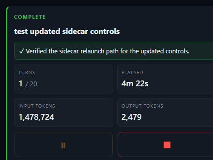

# mission — autonomous turn continuation

A Copilot CLI extension. Tell it your objective once with `/mission start <objective>`. It nudges the agent to keep working toward that objective, one continuation per idle turn, until the objective is met (the agent emits `MISSION_COMPLETE: <summary>`) or the turn cap (default 20) is exhausted.

This is a Copilot CLI extension inspired by Codex's `/goal` feature — built as a pure extension with no host-side changes.

## Install

The extension lives at `~/.copilot/extensions/mission/`. Reload extensions or restart the Copilot CLI to pick it up. **Requires infinite sessions** (the extension fails loud if `session.workspacePath` is unavailable — see Non-Goals).

## Use

```
/mission start refactor src/foo.ts to remove the global mutex
```

Then send any prompt (or just press Enter on an empty turn) to start the loop. The agent works one turn, becomes idle, mission waits ~1.5s (grace window — your chance to cancel), then injects a continuation prompt visible in the timeline:

```
[mission 1/20] Continue toward: "refactor src/foo.ts to remove the global mutex"
When the objective is fully met, end your reply with a line:
MISSION_COMPLETE: <one-sentence summary>
Otherwise take the next concrete step.
```

The agent works another turn. Loop continues. When the agent finishes, it emits the `MISSION_COMPLETE:` line and mission stops automatically.

## Commands

| Command | Effect |
| --- | --- |
| `/mission start <objective>` | Arm a new objective. If one is active, you're asked to confirm replacement (when the host supports it). |
| `/mission show` | Print current status and open the sidecar UX with the latest snapshot. |
| `/mission pause` | Suppress continuations; objective is preserved. |
| `/mission resume` | Un-pause. |
| `/mission clear` | Drop the objective; return to idle. |
| `/mission off` | **Durable** disable. Persists across sessions. |
| `/mission on` | Re-enable after `off`. |
| `/mission help` | Subcommand list. |

When `/mission show` opens the sidecar with no active objective, the idle view includes an objective text box and **Start mission** button. The button uses the same localhost control channel as Pause / Resume / Stop, so starting from the sidecar does not require returning to the terminal.

Cancelling during the grace window via `pause`, `clear`, or `off` prevents the next continuation from firing — no model spend.

Pressing Ctrl-C during a continuation also aborts cleanly: mission honors `session.idle.aborted` and will not fire the next continuation.

Switching to plan mode auto-pauses an armed objective. Mission never auto-resumes — that's always your call.

## State

Persisted to `<session-workspace>/mission.json`. Survives `/clear` and session resume. Inspect or hand-edit if you really want; `inFlight: true` is forced to `false` on load (a process restart invalidates any in-flight send).

On first load after upgrading from `/autopilot`, mission migrates `<session-workspace>/autopilot.json` to `mission.json` and removes the old file.

Completion detection accepts `MISSION_COMPLETE:` and the legacy `AUTOPILOT_COMPLETE:` token so resumed sessions can finish cleanly after the rename. New continuation prompts only ask for `MISSION_COMPLETE:`.

## Non-goals (and why)

These differ from Codex's `/goal` because the Copilot CLI extension API doesn't expose the necessary surfaces. Building hacks around those gaps would mean fragile UX, not parity.

| Codex feature | Status here | Why |
| --- | --- | --- |
| Persistent footer / statusline showing the active objective | **Not provided.** | The CLI exposes `session.log()` to the scrollback timeline only. There is no extension-visible footer/statusline channel. We tried OSC 0 escape sequences (`ESC ] 0 ; <text> BEL`) to write the terminal title bar from the extension subprocess; the host PTY captures and discards them. Confirmed dead end. |
| Notification suppression while continuations fire | **Not provided.** | No SDK API for muting notifications from an extension. |
| Exact token budget tracking | **Approximate.** | The sidecar accumulates root-agent `assistant.usage` input/output/cache/reasoning token deltas while an objective is active. SDK usage events can undercount sub-agent and MCP token usage. The hard turn cap is the durable safety; budget reporting is best-effort. |
| Works without infinite sessions | **No.** | Without `session.workspacePath` the durable `off` flag and an active objective would silently vanish on `/clear` or resume. We fail loud at startup rather than pretend to work. |

## Safety / kill switches

- **Hard turn cap** (default 20). Independent of objective wording. Once spent, mission won't fire again until `/mission start <new>`.
- **Grace window** (1.5s). Cancellation paths (`pause` / `clear` / `off`) checked after grace; if state changed, no send.
- **Abort honor.** Ctrl-C sets `session.idle.aborted=true`; mission skips the continuation.
- **Plan-mode auto-pause.** Switching the host to plan mode pauses an armed objective. Manual resume only.
- **Durable disable.** `/mission off` persists; survives session resume and `/clear`.

## Sidecar viewer

When an objective is armed (status: `armed`, `paused`, `spent`, or `complete`), mission opens a small chromeless browser window with:



- **Status badge** — `armed` / `paused` / `spent` / `complete`, with a `· firing` suffix while a continuation is in-flight.
- **Active objective** — wrapped, full-text.
- **Turns** — fired / cap.
- **Elapsed timer** — live ticking since the objective was armed.
- **Token consumption** — separate best-effort root-agent `assistant.usage` totals for input and output tokens. Counters reset on each new objective and are not persisted across extension reloads.
- **Controls** — large icon buttons for `Pause` / `Resume` and `Stop`.

The window auto-closes when status returns to `idle` (cleared) or mission is turned off.

Implementation: zero-dep `node:http` + hand-rolled WebSocket on `127.0.0.1` (OS-assigned port), token-gated, opened via `msedge --app=` (or `chrome --app=`). Profile dir at `~/.copilot/mission-viewer-profile/`. Same proven pattern as the backlog sidecar.

## Hard cap override

```
/mission start --cap 5 finish writing the migration script
/mission start --cap=10 ship the bugfix
```

`--cap` accepts a positive integer between 1 and 100. Above 100 it's clamped (with a warning) for safety.

## File layout

```
~/.copilot/extensions/mission/
├── extension.mjs    SDK wiring (joinSession, event handlers)
├── controller.mjs   Lifecycle controller (the only thing that mutates state)
├── state.mjs        Pure state machine + decision predicate
├── commands.mjs     Slash command parser
├── persistence.mjs  mission.json load/save
├── prompt.mjs       Continuation prompt template + MISSION_COMPLETE detection
├── sidecar.mjs      127.0.0.1 HTTP+WS server + chromeless viewer launcher
├── viewer.html      Single-file dark-card UI rendered in the sidecar window
├── tests/           node:assert smoke tests (run individually with `node tests/<file>`)
└── README.md
```

The strict module split (commands → controller → state-machine → effects → host-bindings) is the architecture even though only one tenant (`/mission`) ships today. Adding a second tenant later (e.g. a generic "continuation engine" used by other extensions) shouldn't require a rewrite.
