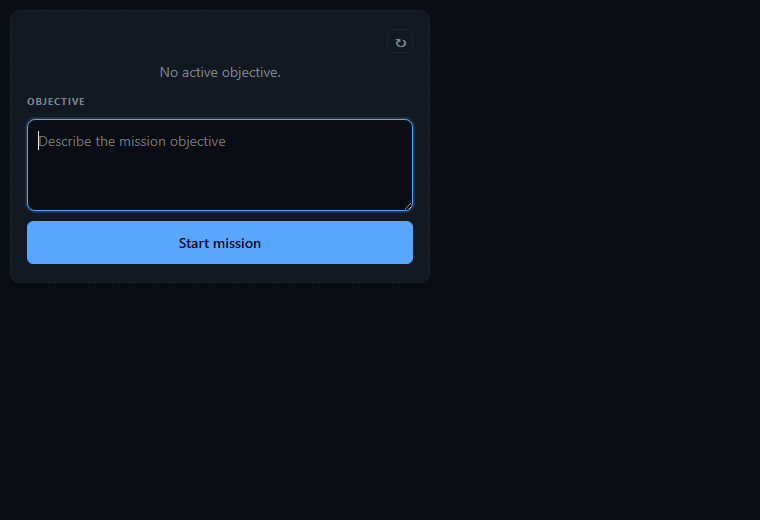
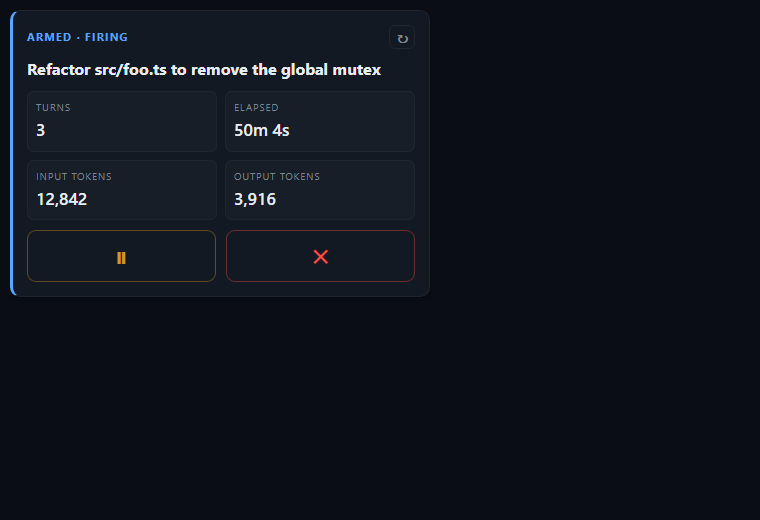
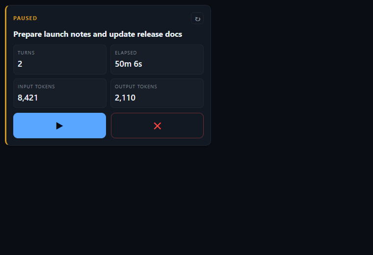
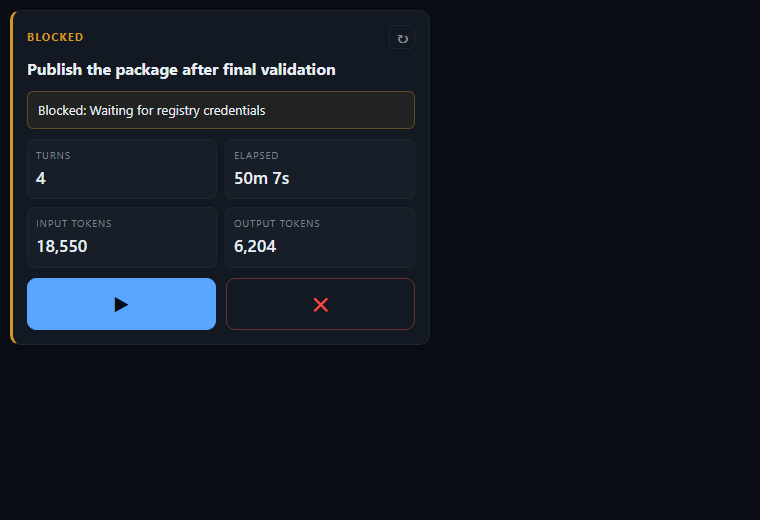

# copilot-cli-mission

A GitHub Copilot CLI extension that **autonomously continues turns toward a stated objective**, with a live sidecar viewer for status and one-click control.

Tell mission your goal once with `/mission <objective>`. It nudges the agent to keep working toward that objective, one continuation per idle turn, until the agent emits `MISSION_COMPLETE: <summary>` or `MISSION_BLOCKED: <reason>`.

A chromeless sidecar window opens automatically while a goal is armed, showing live status, turns, elapsed time, best-effort input/output token consumption, and large icon controls that work even mid-turn.

| Start from the sidecar | Track a running mission | Resume when paused | Recover when blocked |
| --- | --- | --- | --- |
|  |  |  |  |

Inspired by Codex's `/goal` feature — built as a pure Copilot CLI extension with no host-side changes.

## Install

### 1. Enable experimental Copilot CLI extensions

In a Copilot CLI session:

```
/experimental
```

Enable the **Extensions** feature. If your Copilot CLI version does not show that option, add `"EXTENSIONS"` to `experimental_flags` in `~/.copilot/config.json` and restart.

### 2. Install the plugin from GitHub

```
copilot plugin install supermem613/copilot-cli-mission
```

Verify:

```
copilot plugin list
```

### 3. Enable the `/mission` extension

The plugin install puts the package on disk. The `/mission` command and sidecar are loaded as a Copilot CLI SDK extension discovered from the user extensions folder.

If you previously installed the old `/autopilot` extension, rerun the shim installer below. It removes the legacy user shim it owns at `~/.copilot/extensions/autopilot/` and installs the new `mission` shim.

Easiest path — in a Copilot CLI session, run:

```
Use the mission-install skill to enable the /mission command.
```

The skill installs a small user-scoped delegate at `~/.copilot/extensions/mission/extension.mjs` that imports the SDK extension from the plugin install location.

If you prefer to do it by hand, paste this into your shell after `copilot plugin install` completes:

PowerShell:

```powershell
$installer = Get-ChildItem "$env:USERPROFILE\.copilot\installed-plugins" -Directory -Recurse |
  Where-Object { Test-Path (Join-Path $_.FullName "scripts\install-extension-shim.mjs") } |
  Select-Object -First 1 -ExpandProperty FullName

if (-not $installer) { throw "Could not find installed copilot-cli-mission plugin." }

node (Join-Path $installer "scripts\install-extension-shim.mjs")
```

Bash/zsh:

```bash
installer="$(find "$HOME/.copilot/installed-plugins" -type f -path '*/scripts/install-extension-shim.mjs' | head -n 1)"
if [ -z "$installer" ]; then echo "Could not find installed copilot-cli-mission plugin." >&2; exit 1; fi
node "$installer"
```

In Copilot CLI:

```
/extensions
```

Enable `mission` under **User**. Then run `/mission help` to confirm.

## Use

```
/mission refactor src/foo.ts to remove the global mutex
/mission
/mission pause
/mission resume         # also retries a blocked mission
/mission clear
```

`/mission` prints the current status and opens the sidecar UX with the latest snapshot, even when there is no active objective. `/mission resume` also opens the sidecar after resuming or retrying a blocked mission.
When idle, the sidecar includes an objective text box and **Start mission** button so you can start from the UX.

The agent works one turn, becomes idle, mission waits ~1.5s (grace window — your chance to cancel), then injects a continuation prompt visible in the timeline:

```
[mission turn 1] Continue toward: "refactor src/foo.ts to remove the global mutex"
When the objective is fully met, end your reply with a line:
MISSION_COMPLETE: <one-sentence summary>
If there is no viable next step without user input, end with:
MISSION_BLOCKED: <what is blocking progress>
Otherwise take the next concrete step.
```

When the agent finishes, it emits the `MISSION_COMPLETE:` line and mission stops automatically. If it cannot make meaningful progress without user input, it emits `MISSION_BLOCKED:` and mission stops in a blocked state instead of spending another turn.

The sidecar window (chromeless `msedge --app=` on Windows; falls back to default browser elsewhere) opens whenever a goal starts, resumes, or becomes blocked. Click **Pause / Resume / Retry** or **Clear** any time — the buttons hit a localhost HTTP endpoint that bypasses the host's slash-command queue, so they work *during* an in-flight LLM turn.

See [`.github/extensions/mission/README.md`](./.github/extensions/mission/README.md) for the full command reference, safety/kill-switches, non-goals, and architecture notes.

## Develop

```bash
git clone https://github.com/supermem613/copilot-cli-mission.git
cd copilot-cli-mission
npm run check    # node --check on every .mjs
npm test         # 7 test files, 82 assertions
```

To run your local working tree as the live extension (instead of the installed plugin), drop a one-line shim at `~/.copilot/extensions/mission/extension.mjs` that dynamic-imports your working tree. **Do not** point the directory itself at the working tree with a junction or symlink — Copilot CLI's extension loader does not pick those up.

```powershell
# Windows
$ext = "$env:USERPROFILE\.copilot\extensions\mission"
Remove-Item $ext -Recurse -Force -ErrorAction SilentlyContinue
New-Item -ItemType Directory -Path $ext | Out-Null
$target = "$PWD\.github\extensions\mission\extension.mjs"
@"
import { pathToFileURL } from "node:url";
await import(pathToFileURL($($target | ConvertTo-Json)).href);
"@ | Set-Content -Path "$ext\extension.mjs" -NoNewline
```

```bash
# macOS / Linux
ext="$HOME/.copilot/extensions/mission"
rm -rf "$ext"
mkdir -p "$ext"
target="$PWD/.github/extensions/mission/extension.mjs"
cat > "$ext/extension.mjs" <<EOF
import { pathToFileURL } from "node:url";
await import(pathToFileURL("$target").href);
EOF
```

Then `/extensions` → reload `mission`. Edits to the working tree take effect on the next `extensions reload` (the shim is just a delegate; your working tree is the real source).

## Repo layout

```
copilot-cli-mission/
├── .github/
│   ├── extensions/mission/    SDK extension (extension.mjs + 6 modules + viewer.html + tests)
│   └── workflows/ci.yml         Cross-platform CI: node --check + tests on Node 24
├── scripts/
│   └── install-extension-shim.mjs   Writes the user-scoped delegate after plugin install
├── skills/
│   └── mission-install/SKILL.md   Setup skill the user invokes from a Copilot CLI session
├── plugin.json                  Plugin metadata (name, version, skills dir)
├── package.json                 npm scripts (check, test)
├── LICENSE                      MIT
└── README.md                    (this file)
```

## License

MIT © Marcus Markiewicz
